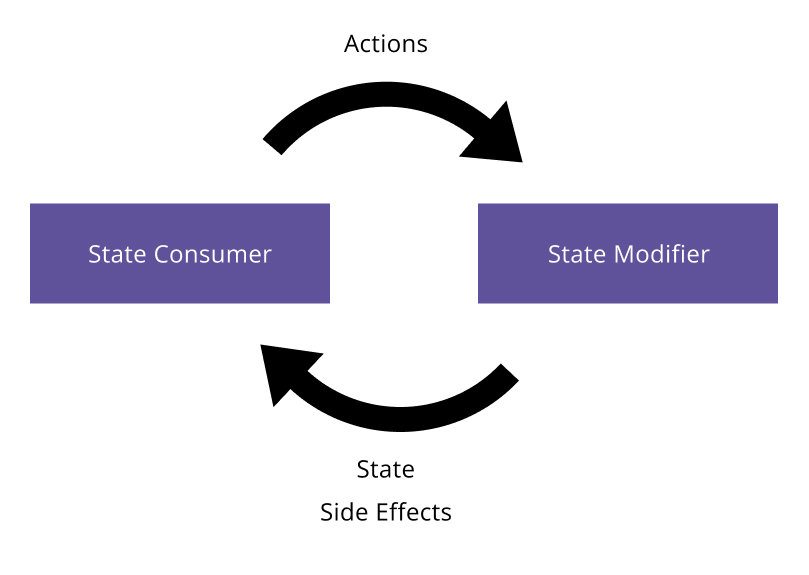

### Modern Android Development Template

This repository contains a simple Android app that implements my take on Modern Android development. It should serve as
a starting point for new projects.

It is based on an MVI architecture and uses [Cash App's Molecule library](https://github.com/cashapp/molecule) for state
management. It uses Android ViewModels under the hood. Inspired by [Workflow](https://square.github.io/workflow/), I've
introduced my own Rendering model, which is a class that holds state, a side effects Flow, and an event sink. I've
created my own getRendering function that converts the state-managing Composable functions into Renderings immediately
usable inside my Compose UI without dealing directly with the Android ViewModel.

## Architecture

The DiceScreen is a simple example that uses all the architecture capabilities. DiceScreen.kt is the State
Consumer in the illustration below. It listens to the state and side Effects from the State Modifier, our Presenter in
this case. It renders the UI based on the State, listens to side effects events, and carries them out. The Presenter
receives events from the UI, modifies the State, and emits side effects.

Unit testing our State Modifiers is straightforward and UI testing can be done with Maestro nowadays. There is a Maestro
flow.yaml in the android module.

One of the main advantages of this architecture is that everything but the State Consumer is platform-agnostic. With
Kotlin Multiplatform, we can reuse everything else on iOS. Not only the state management logic but also all the other
layers. The business logic, the network client, the data layer, the repository, the domain models, dependency injection,
etc. Everything from the State Modifier and below.

All we need to do is re-implement the State Consumer to render the UI and react to side effects, and we can do this in a
platform-native way.

# Future

In the future, I plan to create another repository to showcase how to reuse the architecture on iOS with SwiftUI and
Kotlin Multiplatform. The current repository, however, will remain Android-only to keep things simple.
